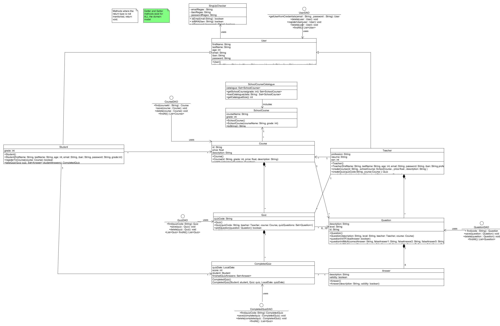
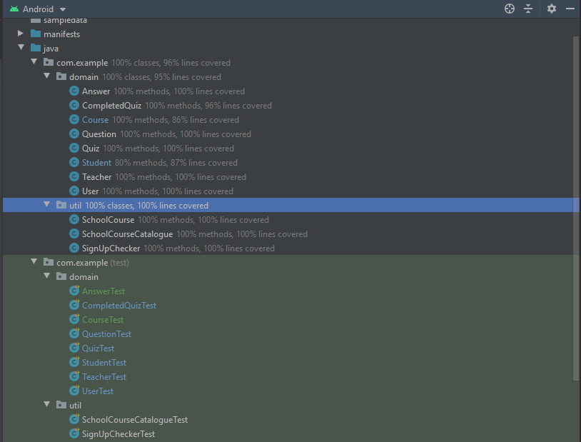
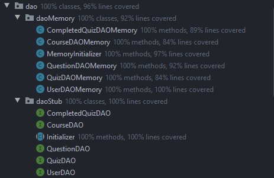
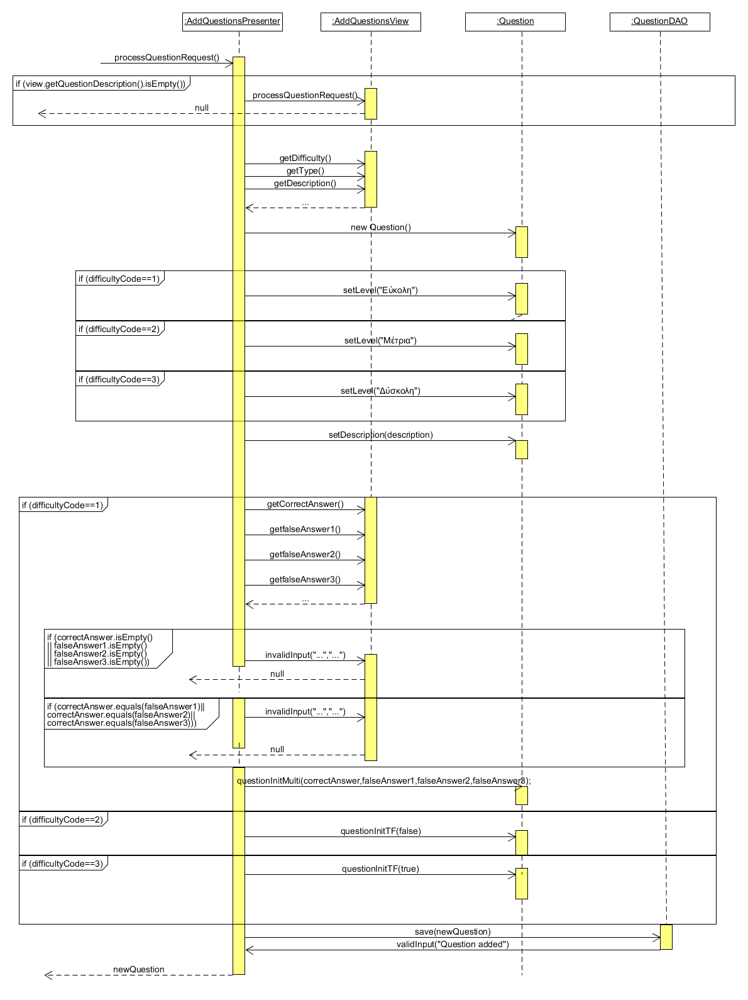

# Λογική του Πεδίου

## Μοντέλο πεδίου

## Διάγραμμα Κλάσεων (Domain classes and DAOs)

## Διάγραμμα Κλάσσεων ΠΧ "ΤΑΥΤΟΠΟΙΗΣΗ ΧΡΗΣΤΗ"

## Διάγραμμα Κλάσσεων ΠΧ "ΕΓΓΡΑΦΗ ΜΑΘΗΤΗ" (ΠΑΡΟΜΟΙΑ ΜΕ ΠΧ "ΕΓΓΡΑΦΗ ΚΑΘΗΓΗΤΗ")

## Διάγραμμα Κλάσσεων ΠΧ "ΔΗΜΙΟΥΡΓΙΑ ΤΡΑΠΕΖΑΣ ΕΡΩΤΗΣΕΩΝ"

## Αναφορά Καλύψεων του Κώδικα

## Διαγράμματα Ακουλουθίας Σημαντικότερων Περιπτώσεων Χρήσης

#### [ΠΧ11 Ταυτοποίηση Χρήστη](uc11-login-validation.md)

#### [ΠΧ8 Δημιουργία Τράπεζας Ερωτήσεων](uc8-question-bank-creation.md)
