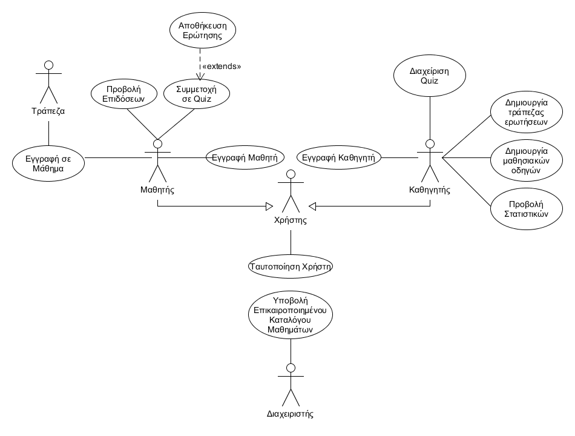
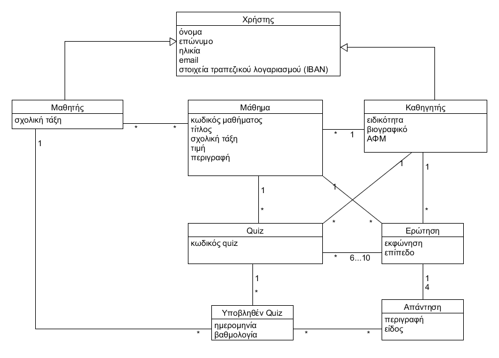

# Εισαγωγή

Το παρόν έγγραφο περιέχει τους συνδέσμους για τις περιγραφές των περιπτώσεων χρήσεις, επιχειρησιακούς κανόνες και τις μη λειτουργικές απαιτήσεις του συστήματος. 

# Συνολική περιγραφή

## Επισκόπηση μοντέλου περιπτώσεων χρήσης

| Περίπτωση Χρήσης | Τίτλος | Περιγραφή |
| :----------------------| :--------| :---------|
| ΠΧ1 | Eγγραφή Μαθητή | Η διαδικασία μέσω της οποίας ο μαθητής εγγράφεται όταν μπαίνει για πρώτη φορά στην εφαρμογή. |
| ΠΧ2 | Συμμετοχή σε Quiz | Ο μαθητής απαντάει σε ερωτήσεις ενός διαγωνίσματος. Παράλληλα, βλέπει αν οι απαντήσεις που δίνει είναι σωστές ή λάθος. |
| ΠΧ3 | Προβολή Επιδόσεων | Ο μαθητής βλέπει τις βαθμολογίες του σε όλα τα διαγωνίσματα που έχει συμμετάσχει μέχρι τώρα.. |
| ΠΧ4 | Αποθήκευση Ερώτησης | Ο μαθητής μπορεί κατά τη διάρκεια ενός διαγωνίσματος να αποθηκεύει ερωτήσεις, για μελλοντική επανάληψη. |
| ΠΧ5 | Εγγραφή σε Μάθημα | Ο μαθητής επιλέγει πακέτα μαθημάτων που προσφέρονται, αφού πρώτα δει την περιγραφή τους. |
| ΠΧ6 | Εγγραφή Καθηγητή | Η διαδικασία μέσω της οποίας ο καθηγητής εγγράφεται όταν μπαίνει για πρώτη φορά στην εφαρμογή. |
| ΠΧ7 | Διαχείριση Quiz | Ο καθηγητής προσθέτει, επεξεράζεται και κυκλοφορεί ένα κουηζ προς επίλυση από τους μαθητές του. |
| ΠΧ8 | Δημιουργία Τράπεζας Ερωτήσεων | Ο καθηγητής δημιουργεί τη δική του τράπεζα ερωτήσεων για ένα ή περισσότερα μαθήματα. |
| ΠΧ9 | Δημιουργία Μαθησιακών Οδηγών | Ο καθηγητής δημιουργεί ένα μαθησιακό οδηγό, δηλαδή σειρά από κουήζ, για ένα ή περισσότερα σχολικά μαθήματα. |
| ΠΧ10 | Προβολή Στατιστικών | Ο καθηγητής πορεί να ελέγχει τις βαθμολογίες των μαθητών στα διαγωνίσματα του και σχετικά στατιστικά επιτυχίας/αποτυχίας. |
| ΠΧ11 | Ταυτοποίηση Χρήστη | Ο μαθητής ή ο καθηγητής κάνει είσοδο στην εφαρμογή. |
| ΠΧ12 | Υποβολή Επικαιροποιημένου Καταλόγου Μαθημάτων | Ο διαχειριστής εξασφαλίζει την ύπαρξη ενός βασικού καταλόγου μαθημάτων για τις διάφορες τάξεις του σχολείου.. |

### Περιγραφές περιπτώσεων χρήσης

#### [ΠΧ1 Eγγραφή Μαθητή](uc1-student-sign-up.md)

#### [ΠΧ2 Συμμετοχή σε Quiz](uc2-quiz-participation.md)

#### [ΠΧ3 Προβολή Επιδόσεων](uc3-performance-tracking.md)

#### [ΠΧ4 Αποθήκευση Ερώτησης](uc4-question-saving.md)

#### [ΠΧ5 Εγγραφή σε Μάθημα](uc5-course-selection.md)

#### [ΠΧ6 Εγγραφή Καθηγητή](uc6-teacher-sign-up.md)

#### [ΠΧ7 Διαχείριση Quiz](uc7-quiz-management.md)

#### [ΠΧ8 Δημιουργία Τράπεζας Ερωτήσεων](uc8-question-bank-creation.md)

#### [ΠΧ9 Δημιουργία Μαθησιακών Οδηγών](uc9-study-guide-creation.md)

#### [ΠΧ10 Προβολή Στατιστικών](uc10-statistics-tracking.md)

#### [ΠΧ11 Ταυτοποίηση Χρήστη](uc11-login-validation.md)

#### [ΠΧ12 Υποβολή Επικαιροποιημένου Καταλόγου Μαθημάτων](uc12-course-catalogue-posting.md)

## Συμπληρωματικές προδιαγραφές

### Απαιτήσεις διεπαφών

#### Διεπαφές χρήστη

* Όταν ο χρήστης ανοίγει την εφαρμογή εμφανίζεται οθόνη με κουμπιά "Εγγραφή ως μαθητής", "Εγγραφή ως καθηγητής" και "Σύνδεση" το ένα κάτω από το άλλο.
* Ανάλογα με τον τύπο χρήστη θα διαμορφώνεται η αρχική σελίδα όπου θα υπάρχει μενού με όλες τις ενέργειες που μπορεί να πραγματοποιήσει.
* Για κάθε ένεργεια πρέπει να υπάρχει κουμπί που επιστρέφει στην προηγούμενη οθόνη.

#### Διεπαφές επικοινωνίας

* Το σύστημα αποστέλνει ηλεκτρονικό μήνυμα στην περίπτωση που ο χρήστης θέλει να αλλάξει κωδικό πρόσβασης για την είσοδό του στο σύστημα.

#### Διεπαφές λογισμικού

* Για την πραγματοποίηση πληρωμής μαθήματος, το σύστημα θα επικοινωνήσει με το σύστημα της τράπεζας.

### Περιορισμοί σχεδίασης και υλοποίησης

**Βάσεις Δεδομένων**:  
* Το σύστημα θα πρέπει να υποστηρίζει το σχεσιακό σύστημα διαχείρισης βάσεων δεδομένων PostgreSQL.  

**Java**:  
* Το σύστημα θα αναπτυχθεί σε java χρησιμοποιώντας Android Studio.
* Το σύστημα θα μπορεί να εκτελείται σε συσκευές με λειτουργικό σύστημα Android.

### Ποιοτικά χαρακτηριστικά

#### Απόδοση

* Το σύστημα θα πρέπει να υποστηρίζει την ταυτόχρονη είσοδο πολλών χρηστών.
* Η απόκριση της βάσης δεδομένων σε κάθε αίτημα δεν πρέπει να ξεπερνά τα 3 δευτερόλεπτα.

#### Διαθεσιμότητα

* Το σύστημα θα είναι διαθέσιμο 24 ώρες το εικοσιτετράωρο.
* Ο χρόνος μη διαθεσιμότητας σε περίπτωση βλάβης ή συντήρησης δεν θα ξεπερνά την 1 ώρα.

#### Ασφάλεια

* Όλες οι λειτουργίες θα πραγματοποιούνται αφού ταυτοποιηθεί ο χρήστης από το σύστημα.
* Εφαρμόζεται ο κανονισμός GDPR.

#### Ευελιξία

* Κατά τη διάρκεια της συντήρισης του λογισμικού, όλες οι αλλαγές στο σύστημα θα πρέπει να υλοποιηθούν εντός 10 ημερών.
* Σε περίπτωση βλάβης της βάσης δεδομένων, υπάρχει backup με το οποίο επαναφέρουμε το σύστημα στην τελευταία εκδοχή του.

#### Ευχρηστία

* Εύκολο και διαδραστικό User Interface με ελκυστική σχεδίαση, κατάλληλο για αρχάριους χρήστες.

# Υποστηρικτικό υλικό

## Μοντέλο πεδίου

## Επιχειρησιακοί κανόνες

| Επιχειρησιακοί κανόνες | Περιγραφή |
| :----------------------| :---------|
| ΕΚ1 | Η διεύθυνση email μοναδική για κάθε χρήστη|
| ΕΚ2 | Το ΑΦΜ και το IBAN είναι μοναδικά για κάθε καθηγητή |
| ΕΚ3 | Η ηλικία των καθηγητών πρέπει να είναι μεγαλύτερη ή ίση των 22 ετών|
| ΕΚ4 | Κάθε καθηγητής κατέχει τουλάχιστον ένα πτυχίο |
| ΕΚ5 | Kάθε μαθητής παρακολουθεί τα μαθήματά του από τουλάχιστον έναν καθηγητή|
| ΕΚ6 | Πρέπει να υπάρχουν τουλάχιστον 8 ερωτήσεις σε κάθε δημιουργημένη τράπεζα θεμάτων των καθηγητών|
| ΕΚ7 | Κάθε quiz αποτελείται από 6-10  ερωτήσεις |
| ΕΚ8 | Οι χρήστες έχουν διεύθυνση email και πρόσβαση σε τραπεζικό λογαριασμό |
| ΕΚ9 | Οι μαθητές παρακολουθούν μόνο μαθήματα της τάξης τους |
| ΕΚ10 |Στις φόρμες συμπλήρωσης, συμπληρώνονται όλα τα στοιχεία
