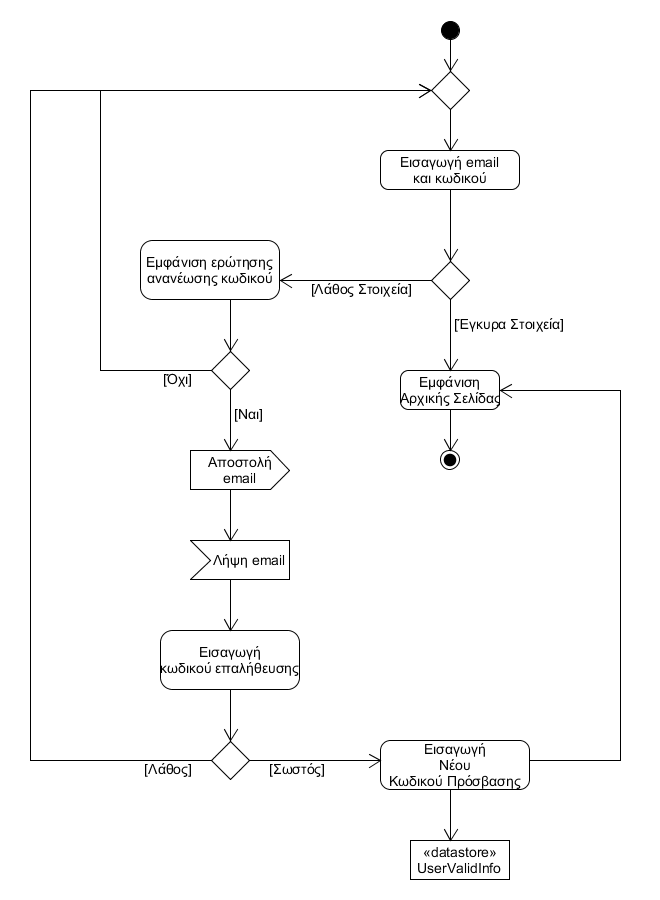
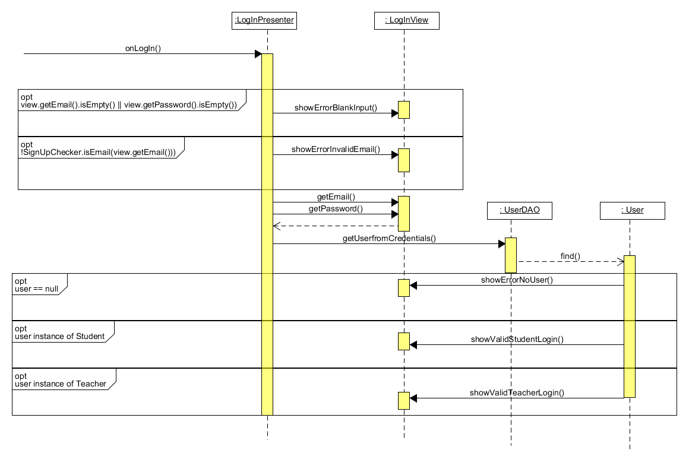

# ΠΧ11. Ταυτοποίηση Χρήστη

**Πρωτεύων Actor**: Χρήστης  
**Ενδιαφερόμενοι**:  
* <b>Μαθητής:</b> Θέλει να μπορεί να κάνει σύνδεση στην εφαρμογή για να έχει πρόσβαση στα μαθήματα του και να συμμετέχει σε quiz.
* <b>Καθηγητής:</b> Θέλει να μπορεί να κάνει σύνδεση στην εφαρμογή για να χρησιμοποιήσει τις υπηρεσίες της, όπως να δημοσιεύσει quiz και να βλέπει τις βαθμολογίες των μαθητών του.

**Προϋποθέσεις**: Ο Χρήστης έχει εκτελέσει με επιτυχία την περίπτωση χρήσης "Εγγραφή Μαθητή", αν είναι μαθητής ή "Εγγραφή Καθηγητή" αν είναι καθηγητής.  

## Βασική ροή
### Α) Ταυτοποίηση χρήστη
1. Το σύστημα εμφανίζει τη σελίδα σύνδεσης στο χρήστη.
2. Ο χρήστης πληκτρολογεί το email και τον κωδικό του και πατάει το κουμπί σύνδεσης.
3. Το σύστημα επιβεβαιώνει στο χρήστη ότι έβαλε σωστά στοιχεία εισόδου.
4. Ο χρήστης επιλέγει το κουμπί "Αρχική σελίδα".
5. Το σύστημα ανακατευθύνει το χρήστη στην αρχική σελίδα της εφαρμογής.

## Εναλακτικές ροές
3.α. Τα στοιχεία σύνδεσης είναι λάθος.
1.  Το σύστημα ενημερώνει το χρήστη πως τα στοιχεία του είναι λάθος και τον ρωτάει αν θέλει να κάνει ανάκτηση κωδικού.
    * *1.α. Ο χρήστης επιλέγει πως δε θέλει να ανακτήσει τον κωδικό του.*
 	1. Η περίπτωση χρήσης επιστρέφει στο βήμα 1 της βασικής ροής.
2.  Ο χρήστης επιλέγει πως θέλει να του σταλθεί ένας OTP ("one time password") στο email για να ανακτήσει τον κωδικό του.
3.  Ο χρήστης βλέπει τον κωδικό του στα εισερχόμενα του ηλεκτρονικού ταχυδρομείο του.
4.  Ο χρήστης πληκτρολογεί τον OTP και πατάει επιβεβαίωση.
5.  Το σύστημα ενημερώνει το χρήστη ότι έβαλε σωστό κωδικό επαλήθευσης.
    * *5.α. Το σύστημα ενημερώνει το χρήστη ότι ε΄βαλε λάθος κωδικό επαλήθευσης.*
 	1. Η περίπτωηση χρήσης επιστρέφει στο βήμα 1 της βασικής ροής.
6.  Το σύστημα καλεί το χρήστη να εισάγει έναν νέο κωδικό πρόσβασης.
7. Ο χρήστης πληκτρολογεί το νέον κωδικό πρόσβασης και πατάει το κουμπί επιβεβαίωσης.
8.  Η περίπτωση χρήσης επιστρέφει στο βήμα 5 της βασικής ροής.

##Διαγράμματα

### Διάγραμμα δραστηριότητας

## Διαγράμμα Ακολουθίας

