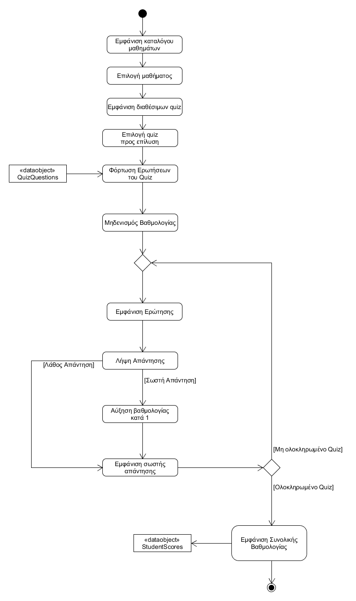
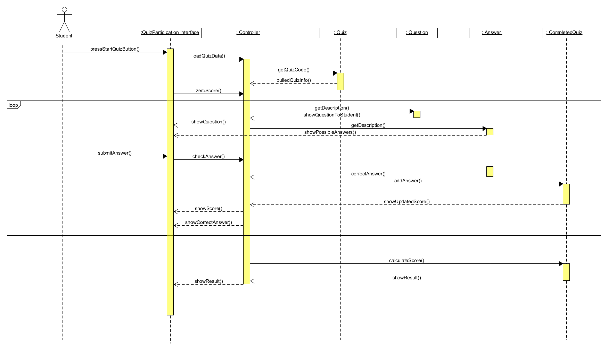

# ΠΧ2. Συμμετοχή σε Quiz
**Πρωτεύων Actor**: Μαθητής
**Ενδιαφερόμενοι**:  
* <b>Μαθητής:</b> Θέλει να λύσει απαντήσει σε ένα quiz.  
* <b>Καθηγητής:</b> Θέλει να λύσει απαντήσει σε ένα quiz.  

**Προϋποθέσεις**: Ο μαθητής να έχει εγγραφεί σε μάθημα.  

## Βασική Ροή

### Α) Συμμετοχή σε Quiz

1. Ο μαθητής πατάει την επιλογή "Συμμετοχή σε quiz".
2. Το σύστημα εμφανίζει όλα τα μαθήματα που έχει αγοράσει ο μαθητής ή διαθέσιμα quiz χωρισμένα ανά μάθημα και κατηγορία.
3. Ο μαθητής επιλέγει το quiz της επιλογής του.
4. Το σύστημα εμφανίζει μια σειρά από ερωτήσεις.
5. Ο μαθητής επιλέγει την απάντηση που πιστεύει ότι είναι σωστή και πατάει το κουμπί "Επόμενη Ερώτηση".
6. Στην τελευταία ερώτηση το σύστημα εμφανίζει το κουμπί "Υποβολή Απαντήσεων".
7. Ο χρήστης επιλέγει το κουμπί "Υποβολή Απαντήσεων" .
8. Το σύστημα εμφανίζει μήνυμα επιτυχούς καταχώρησης των απαντήσεων. 
9. Ο μαθητής μεταφέρεται σε μια σελίδα με τις σωστές απαντήσεις.

**Εναλλακτικές Ροές**

*2α. Δεν βρέθηκαν quiz.*  
1. Το σύστημα εμφανίζει μήνυμα σφάλματος και η περίπτωση χρήσης τερματίζει.

## Διαγράμματα

### Διάγραμμα δραστηριότητας

### Διαγράμμα Ακολουθίας

