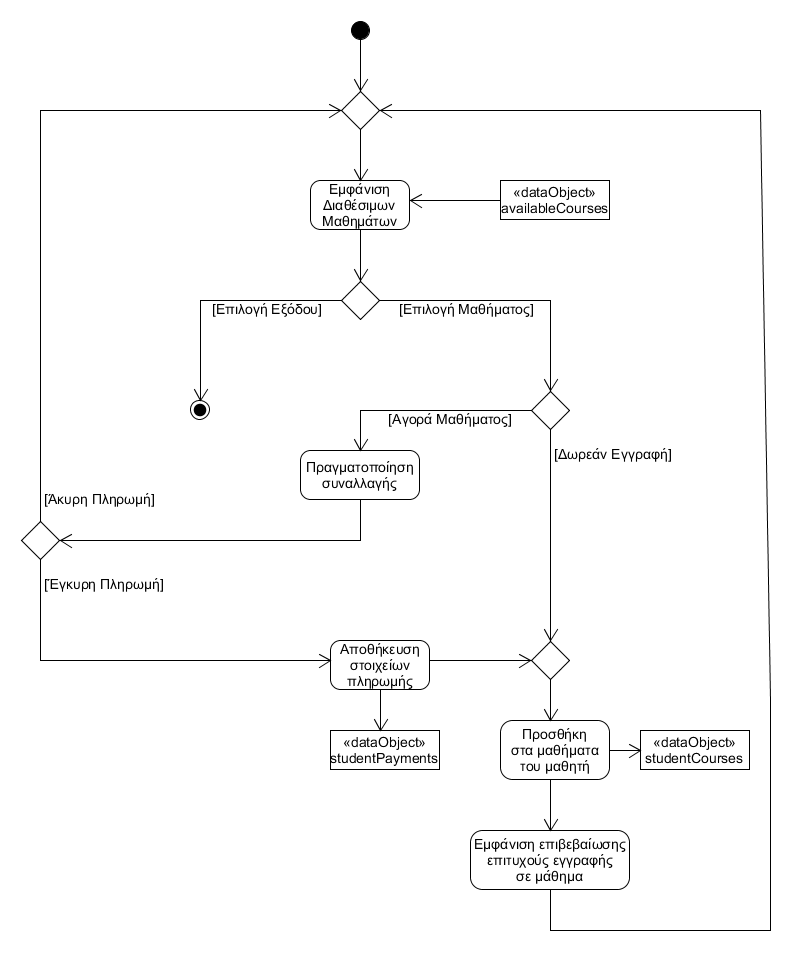
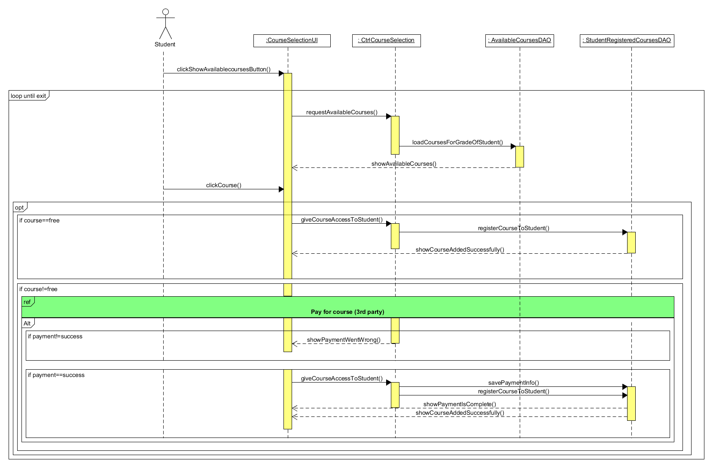

# ΠΧ5. Εγγραφή σε Μάθημα

**Πρωτεύων Actor**: Μαθητής
**Ενδιαφερόμενοι**  
* <b>Μαθητής:</b> Θέλει να παρακολουθήσει ένα ή περισσότερα μαθήματα.
* <b>Καθηγητής:</b> Θέλει τα quiz του να αφορούν αυτό το μάθημα.
* <b>Τράπεζα:</b> Θέλει να γνωρίζει τις συναλλαγές που πραγματοποιούνται.   

**Προϋποθέσεις**: Ο μαθητής έχει εκτελέσει με επιτυχία την περίπτωση χρήσης “Ταυτοποίηση χρήστη”.  

## Βασική Ροή

### Α) Εγγραφή μαθήματος
1. Ο μαθητής πατάει στο κουμπί "Εγγραφή σε Μάθημα".
2. Το σύστημα εμφανίζει τον κατάλογο με τα μαθήματα που προσφέρει η εφαρμογή και ταιριάζουν με τη σχολική του τάξη.
3. Ο μαθητής επιλέγει ένα μάθημα στο οποίο θέλει να εγγραφεί.
4. Το σύστημα εμφανίζει έναν κατάλογο με όλους τους καθηγητές που διδάσκουν το συγκεκριμένο μάθημα.
5. Ο μαθητής επιλέγει τον καθηγητή που επιθυμεί και Πατάει το κουμπί "Ολοκλήρωση Εγγραφής".
6. Το σύστημα ανακατευθύνει το χρήστη σε μία εξωτερική ιστοσελίδα τραπέζης.
7. Ο μαθητής ολοκληρώνει την τραπεζική του πληρωμή.
8. Το σύστημα επιστρέφει μήνυμα επιτυχούς ολοκλήρωσης της εγγραφής σε μάθημα.
9. Η ροή επιστρέφει στο βήμα 2.

## Εναλλακτικές ροές

2.α. Δεν επιθυμεί να επιλέξει κάποιο μάθημα.
1. Ο χρήστης πατάει το κουμπί "Επιστροφή στην Αρχική".
2. Η περίπτωση χρήσης τερματίζει.

3.α. Δεν επιθυμεί το μάθημα που επέλεξε.
1. Ο χρήστης πατάει το κουμπί "Πίσω".
2. Η περίπτωση χρήσης επιστρέφει στο βήμα 2 της βασικής ροής.

5.α. Δεν επιθυμεί τον καθηγητή που επέλεξε.
1. Πατάει το κουμπί "Πίσω" και πηγαίνει στο βήμα 4 της βασικής ροής.

8.α. Η τραπεζική συναλλαγή δεν πραγματοποιήθηκε σωστά, καθώς παραβιάζεται ο κανόνας
      [ΕΚ8](software-requirements.md).*.
1. Δεν πραγματοποιείται η εγγραφή στο μάθημα.
2. Η περίπτωση χρήσης επιστρέφει στο βήμα 2 της βασικής ροής.

## Διαγράμματα

### Διάγραμμα Δραστηριότητας

## Διαγράμμα Ακολουθίας

